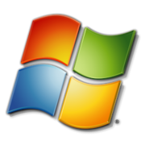

 

  

<h3 align="center">Fun Stuff</h3>

  

    A fun website styled to look like Windows 7, built in React.
     
    <a href="https://reactfunstuff.vercel.app"><strong>Demo</strong></a>
     
     
    <a href="https://github.com/Potato-Development/funstuff/blob/master/src/App.js">View the Code</a>
    ·
    <a href="https://github.com/Potato-Development/funstuff/issues/new?labels=bug&template=bug-report---.md">Report Bug</a>
    ·
    <a href="https://github.com/Potato-Development/funstuff/issues/new?labels=enhancement&template=feature-request---.md">Request a Feature</a>
  

## Built With

[![React][React.js]][React-url]

## Features

* Interactive icons - desktop icons that mimic the original Windows 7 behavior
* Accurate windows - accurate windows that contain the different website functions
* Website sounds - a toggleable and controllable mouse click sound effect

## Roadmap

- [ ] Taskbar with an option to hide
- [ ] Larger sound functionality with error and success sounds
- [ ] Original Notepad app
- [ ] Automatic fullscreen on load
- [ ] Internet Explorer recreation with one website
- [ ] Windows Live Messenger with friends and chat tab
- [ ] Complex horror experience with many features
- [ ] Notifications either automatic or manually triggered
- [ ] Fake Windows update icon (credit to [edamame-maru](https://github.com/edamame-maru))

## License

Distributed under the MIT License. See `LICENSE` for more information.

## Contact

Me - [MysteryFlask](https://github.com/MysteryFlask)

Organization - [Potato-Development](https://github.com/Potato-Development)

Project Link - [https://github.com/Potato-Development/funstuff](https://github.com/Potato-Development/funstuff)

## Acknowledgments

* [salmanarif](https://www.deviantart.com/salmanarif) and [Animelove_1105](http://www.rw-designer.com/user/105799) for the original icon files.
* [The64thGamer](https://www.spriters-resource.com/submitter/The64thGamer/) and [Siul](https://www.spriters-resource.com/submitter/Siul/) for the sprite files.
* All the people of [this thread](https://wink.messengergeek.com/t/resource-hacking-wlm-2009) for the Windows Live Messenger files.
* [Michaelsoft Binbows 7](https://win7.nota-robot.com/) and [Andy's Desk](https://desk.glitchy.website/) for inspiration.
* [This](https://archive.org/details/explorer-archive) archive for the original start menu icon.

[React.js]: https://img.shields.io/badge/React-20232A?style=for-the-badge&logo=react&logoColor=61DAFB
[React-url]: https://reactjs.org/
